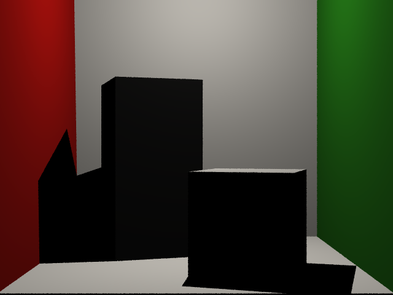

## part1
| grid | time       | num of ray-triangle | image                           |
| ---- | ---------- | ------------------- | ------------------------------- |
| 1x1  | 10.8138    | 19604750            |    |
| 2x2  | 19.83      | 39272098            |    |
| 4x4  | 37.9875    | 78549905            |    |
| 8x8  | 70.4182    | 157093570           |    |

---

## part2
| epsilon scale | time       | num of ray-triangle | image                          |
| ------------- | ---------- | ------------------- | ------------------------------ |
| 1             | 75.0914    | 149316651           |    |
| 10            | 72.918     | 148586616           |   |
| 100           | 72.0397    | 141358796           |  |

---

## part3
| time       | num of ray-triangle | image                              |
| ---------- | ------------------- | ---------------------------------- |
| 273.264    | 588288357           |    |